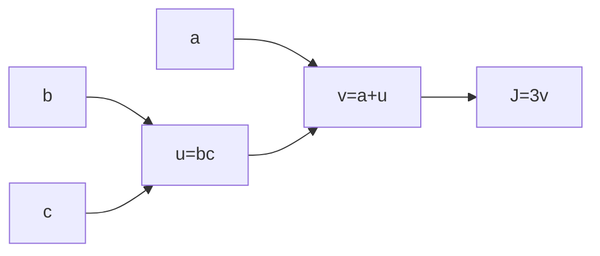
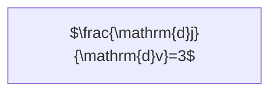
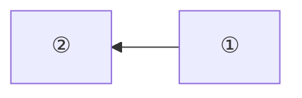

# 人工智能(基础版) - 学习记录(陪某人学AI)

## 二元分类 - 20250504

**新概念：**

1. 前向传播（输入数据集中的一个，走完神经网络，得到输出）
2. 反向传播（根据神经网络的输出和数据集实际结果的diff反向调整神经元权重）

**定理（Let总结）：**

1. 任何输入(图像、音频等等任何)/输出在计算机中都是“数据”，也就是一个一个的数，可以使用矩阵表示

**例子：**

预测一张图像是否是猫🐱

单个输入：一张64x64像素的RGB图像（输入共有64x64x3=12288个数据）

TODO: 描述输入输出定义

## 逻辑回归 - 20250504

二元分类是预测一张图片**是否**为猫🐱，逻辑回归是预测一张图片是猫的**概率**

$x\in \R^{n_x}, b\in \R$

y=2x+1

f(x) = 2x+1

如果x=1那么经过这个函数，f(1)=3

function 

激活函数是数学上的函数，它有严格的公式。

## 损失函数 - 20250504

目标是损失函数值越小时让 $y$ 和 $\hat{y}$ 的差值尽可能小。

代价函数（以 $y=w^Tx+b$ 为例）： $J(w, b)=\frac{1}{m}\sum_{i=1}^{m}\mathcal{L}(i)$

## 梯度下降 - 20250505

假如$J(w)$则可重复进行：$w:=w-\alpha\frac{\partial J(w)}{\mathrm{d} w}$，其中$\alpha$是学习率（步长），$\mathrm{d} $是求导$\partial$是偏导。

假如$J(w,b)$则可重复进行：$w:=w-\alpha\frac{\partial J(w,b)}{\mathrm{d} w},b:=b-\alpha\frac{\partial J(w,b)}{\mathrm{d} b}$ 

## 计算图 - 20250505

假设：$J(a, b, c)=3(a+bc)$，则有计算图：

左到右是前向传播，右到左是反向传播。

①：$\frac{\mathrm{d}j}{\mathrm{d}v}=3$

②：$\frac{\mathrm{d}v}{\mathrm{d}a}=1$

③：$\frac{\mathrm{d}j}{\mathrm{d}a}=\frac{\mathrm{d}j}{\mathrm{d}v}\frac{\mathrm{d}v}{\mathrm{d}a}=3$

④：$\frac{\mathrm{d}v}{\mathrm{d}u}=1$

⑤⑥⑦⑧⑨⑩⑪⑫⑬

这是求导里面的链式传播法则。

# End

> 原创不易，转载请附上[原文链接](https://blog.letmefly.xyz/2025/05/08/Other-AI-LearnAiWithWuenda/)哦~
> [https://blog.letmefly.xyz/2025/05/08/Other-AI-LearnAiWithWuenda/](https://blog.letmefly.xyz/2025/05/08/Other-AI-LearnAiWithWuenda/)
