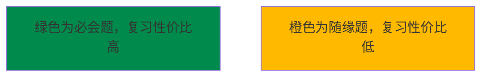
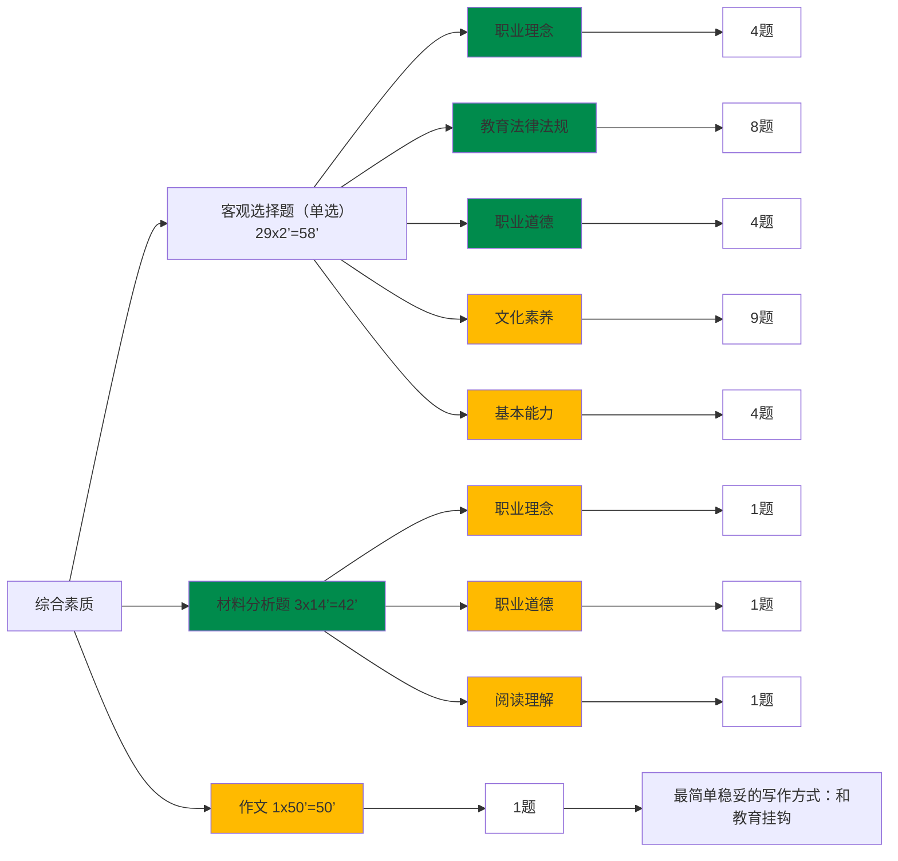
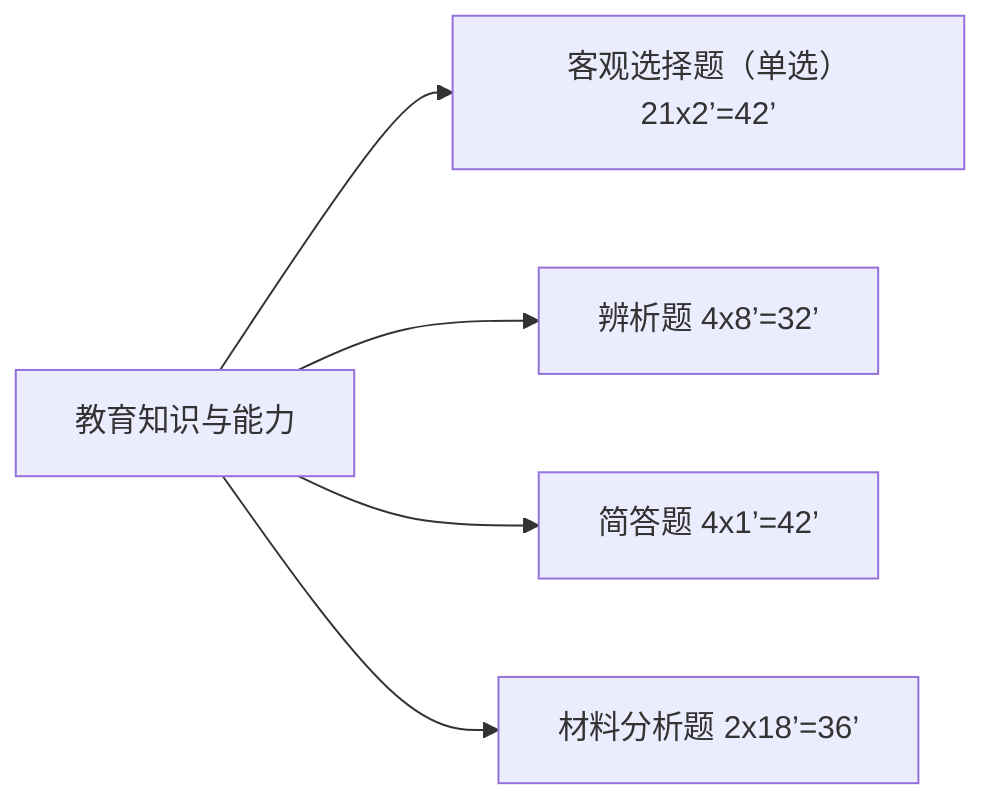
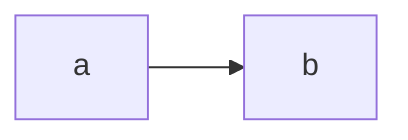

# 教资

## 考试流程

笔试通过后有两年有效期，期间内通过面试就能拿证了。

中小学教资笔试分为三大部分（科目一、科目二、科目三），科目一（综合素质）和科目二（教育知识与能力）都一样且都要考，科目三（学科知识与教学能力）是报啥考啥（例如报的信息学就考计算机）。在有效期内，可以通过一次科目一科目二 和 数个不同科目的科目三，从而获取多个教师资格证。

## 题型介绍

**图例：**

**科目一：综合素质**

> 原创不易，转载请附上[原文链接](https://blog.tisfy.eu.org/2023/06/24/Other-JiaoZi-LearningNotes)哦~
> [https://blog.tisfy.eu.org/2023/06/24/Other-JiaoZi-LearningNotes](https://blog.tisfy.eu.org/2023/06/24/Other-JiaoZi-LearningNotes)