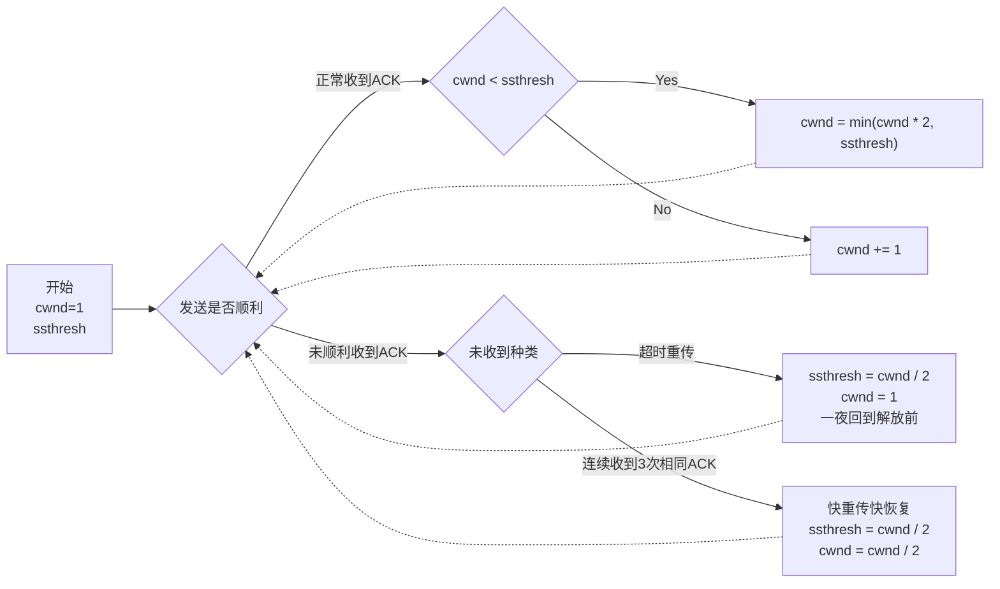

# 面经/八股 - 计网+数据库

## 计算机网络

附[本科计网考试时的复习笔记](https://web.letmefly.xyz/Notes/ComputerNetwork/)，里面有很多ASCII图。

### TCP/IP网络模型

应用层：HTTP、FTP、Telnet、DNS、SMTP等

传输层：TCP(Transmission Control Protocol)、UDP

网络层：IP

网络接口层：网卡层次（封装上MAC地址）

### 三次握手

三次握手目的是**保证双方都有发送和接收的能力**

### 网络传输

交换机的端口不具备Mac地址。

在网络包传输的过程中，源IP和目标IP始终是不会变的（前提：没有使用NAT的网络），一直变化的是MAC地址，因为需要MAC地址在以太网内进行两个设备之间的包传输。

### 浏览器缓存

浏览器缓存分为强制缓存和协商缓存。

#### 强制缓存

只要浏览器判断缓存没有过期，就直接使用本地缓存（此时Status Code为200(from disk cache)）。决定是否使用缓存的主动性在于浏览器这边。

实现原理：利用HTTP响应头部的两个字段

1. `Cache-Control`，是一个相对时间；
2. `Expires`，是一个绝对时间。

二者同时存在的化，`Cache-Control`的优先级更高。（推荐）

#### 协商缓存

协商缓存是客户端和服务器协商之后通过协商结果判断是否使用本地缓存。若浏览器发现客户端不用加载新资源则返回`304`。实现方法有2：

1. 请求头中的`If-Modified-Since`和响应头中的`Last-Modified`。
2. 请求头中的`If-None-Match`和响应头中的`ETag`（每个资源一个id，修改既变）。

`ETag`优先级更高，`Last-Modified`只能做到秒级。

### HTTP/1.1、HTTP/2、HTTP/3

#### HTTP/1.1

HTTP/1.0每次请求都需要三次握手和四次挥手，HTTP/1.1支持长连接（握手，多次请求响应，挥手）。

+ 普通的长连接：每次请求得到响应后才能发起下次请求。
+ 管道网络传输：在收到响应前可以发送多个请求，但服务器必须按顺序响应。

**队头阻塞：** 若请求序列中某请求由于某种原因被阻塞，则后续排队的所有请求也都被阻塞。

管道网络传输解决了请求的队头阻塞问题，但没有解决响应的队头阻塞问题。并且，**HTTP/1.1的管道化技术默认没有开启！** 浏览器也基本上没有支持。

#### HTTP/2

支持了：头部压缩、二进制格式、并发传输、服务器主动推送资源

+ 头部压缩

    使用所谓的`HPACK`算法，客户端和服务器同时维护一张头部信息表，每个字段都会存入并生成索引，重复字段以后就只发送索引号了。

+ 二进制格式

    HTTP/1.1使用纯文本，`200`需要三个字节。HTTP/2头信息和数据体都是二进制格式(统称为帧，头信息帧Headers Frame和数据帧Data Frame)。

+ 并发传输

    多个Stream复用在一条TCP连接，每个Stream可以包含1个或多个Message(对应HTTP/1中的请求或响应)，Message包含一个或多个Frame(HTTP/2的最小单位，以二进制压缩格式存放HTTP/1中的内容(头部、包体))。

    每个Stream有Steram ID，接收端通过Stream ID有序组装成HTTP消息，因此Stream可以乱序发送和并发。

    但仍存在TCP层的队头阻塞问题，前一个字节未到达时后续接收到的字节只能放在内核缓冲区里。

+ 服务器推送

    客户端和服务器双方都可以建立Stream，客户端Steram ID为奇数，服务器为偶数。

    例如HTML需要CSS，直接由服务器推送给客户端吗，就不需要客户端再向服务器发送一次CSS的请求了。

#### HTTP/3

HTTP/3使用基于UDP的QUIC协议，通过应用层保证传输的可靠。只不过目前较新，很多网络设备无法识别QUIC。

+ 无队头阻塞

    QUIC类似HTTP/2的Stream，当某个流丢包时只会阻塞这个流。

+ 更快的连接

    QUIC协议并非与TLS分层，不像HTTP/1.1和HTTP/2需要三次TCP握手和三次TLS握手，只需要三次QUIC握手就能完成建立连接与密钥协商。

    第二次握手的时候，应用包数据可以和QUIC握手信息(连接信息+TLS信息)一起发送，达到0-rtt的效果。

+ 连接迁移

    基于TCP的HTTP协议通过四元组(源IP，源端口，目的ID，目的端口)确定一条TCP连接。网络切换时需要重新握手和挥手以及TCP慢启动，导致明显卡顿。

    QUIC通过连接ID标记通信的两个端点，只要仍有上下文信息哪怕IP改变也能“无缝”使用原连接。

### TCP拥塞控制

拥塞控制是在网络出现拥塞时减小数据发送量从而避免网络整体吞吐量随输入负荷的增大而下降。

拥塞控制主要包括：慢开始(slow-start)、拥塞避免(congestion avoidance)、快重传(fast retransmit)和快恢复(fast recovery)。

若不考虑接收方的窗口大小，则在传递过程中有两个值需要维护：拥塞窗口cwnd、慢启动门限ssthresh(slow start threshold)。

拥塞窗口cwnd是指单次发送数据量为`cwnd`，慢启动门限是确定何时转为拥塞避免(和确定快恢复的窗口大小)的。

#### 慢开始

慢开始并不是慢慢地增长cwnd开始，而是指一开始向网络中注入的报文较少(慢慢地注入)。

初始cwnd为1，ssthresh是一个初始值（具体值不一定）。**若未出现拥塞**，则发送几个包就会收到几个ACK。

每收到几个ACK就将cwnd加几，直到加到ssthresh为止。

> 例如：假设ssthresh是12，则有：
>
> + 最初cwnd = 1，一次发送1个最大报文段MSS，接收方收到1个报文段，并返回1个报文段的ACK。发送方收到1个ACK，cwnd += 1
> + cwnd变为2，一次发送2个报文段，接收方返回2个报文段的ACK。发送方收到2个ACK，cwnd += 2
> + cwnd变为4，一次发送4个报文段，收到4个ACK，cwnd += 4
> + cwnd变为8，一次发送8个报文段，收到8个ACK，cwnd = min(cwnd + 8, ssthresh) = min(16, 12) = 12
> + cwnd变为12，达到ssthresh，不能再指数级增长，开始进入到拥塞控制阶段

#### 拥塞控制

拥塞窗口一直指数级增长迟早有一天要*因为过多而塞满*。当cwnd达到ssthresh后就不再指数级增长，而是每次窗口大小加一（ACK数除以cwnd）。

同样先考虑**若未出现拥塞**的现象，继续慢开始的结尾（cwnd = ssthresh）：

> 此时cwnd = ssthresh = 12：
>
> + cwnd为12，一次发送12个报文，收到12个ACK，窗口增加$\frac{12}{12}=1$
> + cwnd为13，一次发送13个报文，收到13个ACK，窗口增加1
> + cwnd为14...
> + cwnd为15...
> + ...

若未出现拥塞，则会一直处于拥塞控制阶段。

#### 若出现了拥塞怎么办

若出现了**超时重传**，则发送方认为网络出现了拥塞，将会采用一个激进的办法：直接将cwnd调整为1，并将ssthresh调整为出现超时重传时的一半。

继续前面案例，假设拥塞控制阶段当cwnd为32时出现了某个数据包的超时重传，则直接将cwnd调整为1并将ssthresh调整为$\frac{32}{2}=16$。

因$cwnd\lt ssthresh$，故将使用慢开始算法指数级增加拥塞窗口的大小。

真是一夜回到解放前。

#### 快重传和快恢复

有时单个数据包的丢失并非由于发生了网络拥塞所致。直接将窗口调整为1并开始慢启动算法会降低传输效率。

由于一次可能发送多个报文段，所以在连续**3**次收到某个报文的重复确认，就**立即重传**对应报文(快重传)，并将cwnd和ssthresh都设置为当前窗口的一半（cwnd从ssthresh开始而不是从1开始）。

<!-- <svg width="800" height="600" xmlns="http://www.w3.org/2000/svg" author="LetMeFly.xyz" description="绘制了一半发现没箭头">
 <g>
  <title>Layer 1</title>
  <line stroke-width="3" stroke-linecap="undefined" stroke-linejoin="undefined" id="svg_10" y2="580.7318" x2="384" y1="77.51316" x1="384" stroke="#000" fill="none"/>
  <line stroke-width="3" stroke-linecap="undefined" stroke-linejoin="undefined" id="svg_11" y2="580.7318" x2="717.48615" y1="77.51316" x1="717.48615" stroke="#000" fill="none"/>
  <text font-weight="bold" stroke="#000" xml:space="preserve" text-anchor="start" font-family="Noto Sans JP" font-size="24" id="svg_12" y="61.5" x="349" stroke-width="0" fill="#00b0f0">发送方</text>
  <text xml:space="preserve" text-anchor="start" font-family="Noto Sans JP" font-size="24" id="svg_13" y="39.5" x="406" stroke-width="0" stroke="#000" fill="#000000"/>
  <text style="cursor: move;" font-weight="bold" stroke="#000" xml:space="preserve" text-anchor="start" font-family="Noto Sans JP" font-size="24" id="svg_14" y="61.5" x="678.18384" stroke-width="0" fill="#38ffb5">接收方</text>
  <line stroke-width="2" stroke-linecap="undefined" stroke-linejoin="undefined" id="svg_15" y2="124.5" x2="715" y1="94.5" x1="384" stroke="#000" fill="none"/>
 </g>
</svg> -->

放一张俺绘制了很久的图：


> 如上图所示展示了仅仅丢了一个包导致的快重传和快恢复现象。
> 
> + 发送方发送了M1和M2，接收方收到了M1和M2并回复了两个ACK，发送方收到了M1和M2的两个ACK并发送了M3，结果M3丢失了但是发送方并不知情。
> + 发送方继续发送M4、M5、M6，接收方收到M4后发现没有M3，会回复一个收到M2的ACK；接收方收到M5和M6时会分别回复一个收到M2的ACK。
> + 发送方连续3次收到接收方针对M2的ACK，认为M3丢失，立刻重传M3（快重传），并启用**快恢复**算法。
> + 接收方收到重传的M3，则M1至M6全部收到，回复收到M6的ACK。
> + 发送方依据快恢复算法继续动态调整cwnd大小，之后一起顺利进行。

那么，快速恢复算法到底是怎样设置cwnd和ssthresh的呢？前面也说了，就是将cwnd和ssthresh都设置为快重传发生时的一半。由于cwnd已经达到了ssthresh，所以不会慢开始而会直接拥塞避免。

也有一些实现是将cwnd设置为快重传发生时cwnd的一半＋3。

#### 细节答疑

+ 在前面的讲解中，我们把发送完cwnd个数据包并收到所有ACK这整个过程称为“一轮”。但在实际的发送过程中，发送方可以连续发送cwnd个报文并且无需等待所有ACK后才进入下一轮，而是可以根据收到的ACK动态调整cwnd。

+ 整个拥塞控制算法都是以最大报文段MSS的个数为讨论问题的单位，而不是字节。

+ 拥塞控制算法有如下假定条件：

    + 数据是单方向传送，而另一个方向只传送确认；
    + 接收方总是有足够大的缓存空间，因而发送发发送窗口的大小由网络的拥塞程度来决定。

故再作一图以记之



## 数据库

### 索引

+ 按**数据结构**分类：B+tree索引、Hash索引、Full-text索引
+ 按**物理存储**分类：聚簇索引(主键索引)、二级索引(辅助索引)
+ 按**字段特性**分类：主键索引、唯一索引、普通索引、前缀索引
+ 按**字段个数**分类：单列索引、联合索引(复合索引)

#### 聚簇索引、非聚簇索引

MySQL5.5后默认使用InnoDB作为存储引擎。**建表**时聚簇索引：

1. 若有主键，默认使用主键作为聚簇索引
2. 若无主键，选第一列不包含NULL值的唯一列作为聚簇索引
3. 若上述两个都不存在，则InnoDB自动创建一个隐式的自增索引。

二者默认使用的都是B+树索引。

主键索引叶节点存放数据，二级索引叶节点存放主键值。**查询**二级索引时可能需要依据主键值在主键索引的B+Tree中查到数据，这个过程叫做**回表**。

若所查询信息在二级索引的叶节点中就能找到（例如就通过productNum查询productId），则无需再次查询主键索引，这个过程叫做**索引覆盖**。

#### 主键索引、唯一索引、普通索引、前缀索引

+ 主键索引：通常建表时创建，一张表只有一个，不允许有空值
+ 唯一索引：建立在UNIQUE字段上，一张表可以有多个，允许有空值
+ 普通索引：建立在普通字段上的索引，不要求字段未UNIQUE
+ 前缀索引：对字符类型字段的前几个字符建立的索引，可建在字段类型为char、varchar、binary、varbinary的列上

#### 单列索引、联合索引

单列索引：建立在单列上的索引。

联合索引：例如创建一个a, b字段的联合索引，则在B+树中，先依据a字段排序再依据b字段排序。

查询时存在**最左匹配原则**，需要先按a字段匹配再按b字段匹配`WHERE a = 1 AND b = 2`(a和b的顺序不重要，也可以`WHERE b = 2 AND a = 1`，反正查询优化器会优化)。

若只查询b字段，则联合索引将会失效（因为是a字段相同的前提下才会按b字段排序，b字段是全局无序的）。

联合索引的最左匹配原则，在遇到一些范围查询如`>`和`<`的时候就会停止匹配，后面字段无法用到联合索引。但对于`>=`、`<=`、`BETWEEN`、`like前缀匹配`的范围查询并不会立即停止：

+ 例如`WHERE a > 2 AND b = 1`，查询到`a > 2`的范围后，`b`字段不再有序
+ 但是`WHERE a >= 2 AND b = 1`，查询到`a = 2`时`b`字段仍会有序，`a > 2`的范围时`b`字段开始无序
+ 对于`WHERE a BETWEEN 2 AND 4 AND b = 1`，MySQL的`BETWEEN`是闭区间，相当于`a >= 2 AND a <= 4`
+ 对于`WHERE a LIKE 't%' AND b = 1`，查询到`a = 't'`时`b`字段仍有序，`a > 't'`（如`'tf'`时`b`字段总体上开始无序）

#### 索引下推

对于联合索引`(a, b)`，执行语句`select * from table where a > 1 and b = 2`的时候，只有`a`字段能用到索引。在B+树中搜索到`a > 1`的范围后，还需要看`b = 2`是否满足。

+ 在MySQL5.6之前，只能从主键值一个个回表，到主键索引上找出数据行并判断是否满足`b = 2`。
+ 在MySQL5.6引入了**索引下推优化**(index condition pushdown, ICP)，可以在联合索引遍历国策红肿对联合索引中包含的字段做判断，直接过滤掉不满足条件的记录，减少回表次数。

下推其实就是将部分上层(服务层)负责的事情交给了下层(引擎层)去处理。

### 事务

事务必须遵守4个特性（ACID）：

1. 原子性(Atomicity)：一个事务要么全部完成要么一点都不完成
2. 一致性(Consistency)：事务操作前后数据完整性（如A给B转账前后AB总金额不变）
3. 隔离性(Isolation)：多事务并发执行不会相互干扰
4. 持久性(Durability)：事务结束后对数据的修改是永久的，系统故障也不会丢失

InnoBD实现ACID：

1. 持久性：通过redo log(重做日志)来保证
2. 原子性：通过undo log(回滚日志)来保证
3. 隔离性：通过MVCC(多版本并发控制)来保证
4. 一致性：通过持久性+原子性+隔离性来保证

并行执行会带来的问题：

1. 脏读(dirty read)：一个事务读到另一个未提交事务修改过的数据
2. 不可重复度(non-repeatable read)：同一事务内多次读取前后结果不一致
3. 幻读(phantom read)：同一事务内多次查询同一范围数据返回行数不一致

#### 隔离级别

SQL标准提出了4种隔离级别，隔离级别越高性能越低：

+ 读未提交(read uncommitted): 这个事务还没被提交时就能被其他事务看到
+ 读已提交(read committed): 一个事务提交之后，它做的变更才能被其他事务看到
+ 可重复读(repeatable read): 一个事务执行过程中看到的数据跟事务启动时相同(MySQL InnoDB默认隔离级别)
+ 串行化(serializable): 对记录加锁，若多事务读写冲突则后访问的事务必须等前一个事务执行完成

不同隔离级别可能发生的现象：

```
+-----------+        +-----------+        +-----------+      +-----------+
|   脏读    |         |           |       |           |      |           |
|           |        |           |        |           |      |           |
| 不可重复读 |        | 不可重复读 |        |           |      |           |
|           |        |           |        |           |      |           |
|   幻读    |         |   幻读    |        |   幻读    |      |           |
+-----------+        +-----------+        +-----------+      +-----------+

   读未提交              读已提交             可重复读             串行化
```

MySQL支持4种级别的隔离，但与SQL标准中规定的有所出入。MySQL在可重复读隔离级别下就能**很大程度**避免幻读现象的发生。

#### MVCC的Read View

MySQL的InnoDB通过MVCC(Multi-Version Concurrency Control, 多版本并发控制)来实现对事务的隔离，并非加锁实现的。

InnoDB为每行数据添加了三个隐藏字段：

1. 最后一次插入/更新该行的事务id
2. 回滚指针，指向undo log（形成版本链）。若该行未被更新则为空
3. Row ID（该表未设置主键且聚簇索引为空时使用该id生成聚簇索引）

事务启动时，会创建read view，包括4个部分：

1. creator_trx_id：创建该read view的事务id
2. m_ids：创建read view时当前数据库中活跃且未提交的事务id列表
3. min_trx_id：m_ids中的最小值
4. max_trx_id：应该给下一个事务分配的事务id

这样，事务id查询一条记录时：

1. 若修改记录的事务id就是事务id，则该修改记录对该事务可见
2. 若修改记录的trx_id小于read view中的min_trx_id，则说明记录是在read view创建前已提交的事务生成的，该版本的记录对当前事务可见
3. 若trx_id大于等于max_trx_id，说明是该事务启动后的事务修改的，对该事务不可见，该事务开始遍历undo log中的下一条修改记录并进行相同的4种判断
4. 若$min\_trx\_id\leq trx\_id \lt max\_trx\_id$：若该事务id在m_ids列表则说明生成该版本记录事务依然活跃着仍未提交(该版本对当前事务不可见)；若该事务id不再m_ids中则说明生成该版本记录的事务已经被提交(该版本记录对当前事务可见)

可重复读和读提交的实现方式：

1. 可重复读：事务启动时创建一个read view
2. 读提交：每个select都会创建一个read view，这样就能读到其他事务已提交的数据了

#### 幻读被解决了吗

MySQL可重复读隔离级别下，幻读现象的发生与**快照读**和**当前读**密切相关。

> 只有普通查询`select`是快照读，但`update`、`insert`、`delete`、`select ... for update`都是当前读。
>
> 当前读会直接读取数据库中最新已提交的数据，不依赖之前的read view。需要通过**记录锁**(对一条记录加锁)和**间隙锁**(gap locks, 对一个范围加锁)避免幻读。它们存在时范围内的数据修改会被阻塞。

### 锁

#### 全局锁

只要执行下面操作，整个数据库就进入只读状态了。其他进程对数据的增删改、对数据表结构的更改都会被阻塞。

```sql
flush tables with read lock;
```

可通过`unlock tables;`释放全局锁，当前会话断开全局锁也会自动释放。

全局锁主要应用于全库逻辑备份。否则容易出现备份数据和预期不一致：

> 先备份了money表，用户花钱买了商品，又备份了商品表。
>
> 结果备份到的数据money没减商品少了。

但是容易阻塞其他进程。如果数据引擎支持可重复读的隔离级别，则可以在备份前开启事务，生成read view，整个备份过程中都使用这个read view。由于MVCC的支持，备份期间依然可以对数据进行更新操作。如`mysqldump`加上`-single-transaction`(MyISAM不支持)。

#### 表级锁

MySQL的表级锁分为：

1. 表锁
2. 元数据锁(MDL)
3. 意向锁
4. AUTO-INC锁

##### 表锁

```sql
LOCK TABLES t1 READ, t2 WRITE;
UNLOCK TABLES;
```

上述操作第一行会给表t1加读锁，其他进程可以读t1但不能写t1；会给表t2加写锁，其他进程无法读写t2。

如果进程通过上述`LOCK TABLES`的方式显示锁定`t1`、`t2`，则**本线程无法访问其他表**。（如果是`SELECT ... FOR UPDATE`隐式获取的锁，则可访问其他表）

##### 元数据锁

进行数据操作时会自动为该表加上MDL(事务执行期间一直存在)，不需要我们显式声明。

+ 对一张表CRUD时加的是MDL读锁
+ 对一张表做结构更改操作时加的是MDL写锁

MDL是为了保证用户在进行CRUD操作时无其他线程对这个表的结构做了变更。

队列中**写锁获取优先级高于读锁**，一旦出现MDL写锁等待，则会阻塞后续该表的所有CRUD操作。

##### 意向锁

意向锁是为了快速判断表里是否又被加锁记录，不用遍历表中所有值去判断。

+ 使用InnoDB引擎的表里对某些记录加共享锁之前需要先在表级别加一个**意向共享锁**
+ 加独占锁之前要先加一个表级**意向独占锁**

意向共享锁和意向独占锁是表级锁，不会和行级的共享锁和独占锁冲突，且意向锁之间也不会发生冲突，只会和共享表锁(lock tables ... read)和独占表锁(lock tables ... write)发生冲突。

若无意向锁，则在加独占表锁时需要遍历表中所有记录查看是否存在独占锁，效率会很慢。

##### AUTO-INC锁

表里主键通常是自增的，“插入数据时不指定主键值令数据库自动给主键赋递增值”主要是通过AUTO-INC锁实现的。AUTO-INC锁是一个特殊表锁，不是一个事务提交后才释放，而是执行完插入语句后就释放。

AUTO-INC是表级锁，MySQL5.1.22开始InnoDB提供了一种轻量级锁实现自增，可通过系统变量`innodb_autoinc_lock_mode`来控制选用AUTO-INC锁还是轻量级别的锁：

+ `innodb_autoinc_lock_mode`为`0`时采用AUTO-INC锁，语句执行结束才释放锁
+ `innodb_autoinc_lock_mode`为`2`时采用轻量级锁，申请自增主键后就释放锁(而不是等待语句执行完)
+ `innodb_autoinc_lock_mode`为`1`时：

    + 普通`insert`语句自增锁申请之后就马上释放
    + 类似`insert ... select`这种批量插入数据的语句，自增锁还是要等语句结束后才被释放

`innodb_autoinc_lock_mode = 2`是性能最高的方式，但是搭配日志格式是statement的binlog一起使用时，在主从复制场景中会发生数据不一致的问题：

> 考虑以下场景，Session A向表t中插入4行数据，Session B创建了一个结构相同的表t2，两个Session同时执行向表t2中插入数据：
> 
> |             Session A             |              Session B                 |
> |-----------------------------------|----------------------------------------|
> | insert into t values(null, 1,1);  |                                        |
> | insert into t values(null, 2,2);  |                                        |
> | insert into t values(null, 3,3);  |                                        |
> | insert into t values(null, 4,4);  |                                        |
> |                                   | create table t2 like t;                |
> | insert into t2 values(null, 5,5); | insert into t2(c,d) select c,d from t; |
> 
> 若`innodb_autoinc_lock_mode`为`2`(申请完自增主键就释放锁)，则可能会：
> 
> + Session B先插入了两条记录`(1, 1, 1)`、`(2, 2, 2)`
> + Session A申请自增id得到3，插入`(3, 5, 5)`
> + Session B继续执行并插入`(4, 3, 3)`、`(5, 4, 4)`
> 
> 也就是说Session B执行的insert语句生成的id不连续。
> 
> 若`binlog_format = statement`，那么binlog面对t2表只会记录连个Session的insert语句。主从复制时，从库执行binlog中的语句时是顺序执行的，无论binlog中先记录的哪个insert语句，从库中1-4的id都是连续的，就发生了主从不一致。
> 
> 解决方案是binlog的日志格式设置为log，这样binlog中会直接记录主库分配的自增值，从库会和主库保持一致。`innodb_autoinc_lock_mode = 2`且`binlog_format = row`时既能提升并发性，又不会出现数据不一致问题。

#### 行级锁

MySQL的行级锁分为：

1. 记录锁(record lock)：仅对一条记录加锁
2. 间隙锁(gap lock)：锁定一个范围（左右开区间）
3. 临键锁(next-key lock)：记录锁+间隙锁，锁定一个范围

##### 记录锁

锁住一条记录，有共享锁(S锁)和独占锁(X锁)之分。读读兼容，读写不兼容，写写不兼容。

对一条记录加X锁则其他事务就无法修改这条记录了。

##### 间隙锁

只存在于可重复读的隔离级别，目的是为了解决可重复读级别下的幻读现象。

假设表中有一个范围id为(3, 5)的间隙锁，那么其他事务就无法插入id为4的记录了。

间隙锁虽然也存在X型间隙锁和S型间隙锁，但并没有什么区别。间隙锁是兼容的，两个事务可以同时持有包含相同间隙，不存在互斥关系。因为间隙锁的存在目的是为了防止插入幻影记录。

##### 临键锁

记录锁+间隙锁的组合，例如可以锁定`(3, 5]`的范围。其中包含的记录锁可能导致阻塞。

##### 插入意向锁

事务执行插入操作时若插入位置被其他事务加了间隙锁，插入就会阻塞。在此期间会生成一个插入意向锁，表明有事务想在某个区间插入新纪录。

插入意向锁虽然名字有“意向锁”，但实为行级锁。

# 小杂

### B端C端

似乎不是Browser和Client，而是Comsumer和Business（客户端/后台管理）

# End

> 原创不易，转载请经作者同意后附上[原文链接](https://blog.letmefly.xyz/2025/02/18/Other-Notes-Mianjing/)哦~